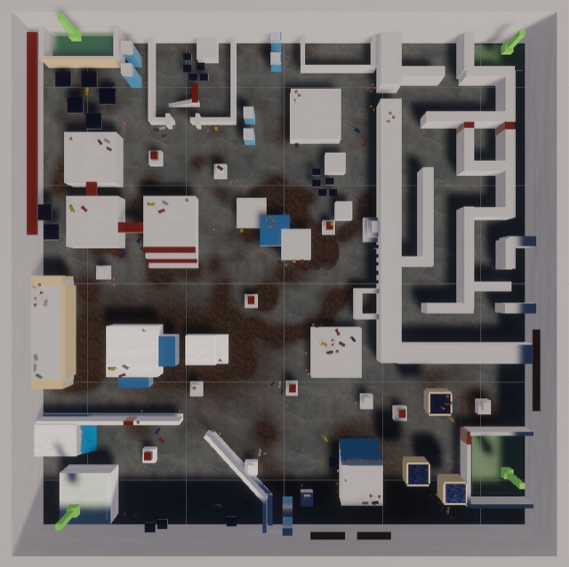

# Navigation Environment
Official codebase for *"Automatic Gameplay Testing and Validation with Curiosity-Conditioned Proximal Trajectories"* paper.
Alessandro Sestini, Linus Gisslén, Joakim Bergdahl, Konrad Tollmar, and Andrew D. Bagdanov.

This repo contains the Navigation Environment used in the paper.

A link to our paper can be found in [arxiv](https://arxiv.org/pdf/2202.10057).

For the visualization tool, see this [repo](https://github.com/SestoAle/CCPT).
For the visualization tool, see this [repo](https://github.com/SestoAle/VisCCPT).

 

    

 

    

### Play the game

You can play the game moving around with 
WASD and jumping with Space. 

### Prerequsites
| Software                                                 | Version         | Required |
| ---------------------------------------------------------|-----------------| ---------|
| **Unity** | tested on v2019.4.28f1 | Yes |
| **ml-agents** | tested on v0.5.0| [download](https://drive.google.com/file/d/18_vvUN9_IPK7_guBRnL91tGzzFR5_V6N/view?usp=sharing) |

**The project was tested only on Linux and Mac OS**.

You can import the required ml-agents folders with the link above.
ml-agents is required just for linking Unity to Python: I use my implementation for DRL algorithms.