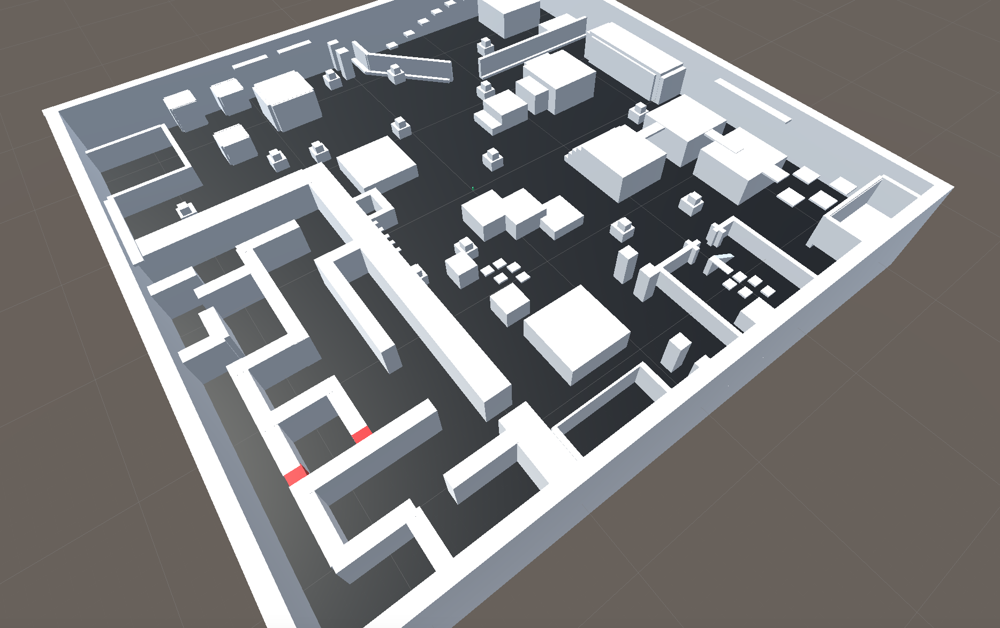

# Playtesting-Env

A relatively big environment (500 m x 500 m x 50 m) for studying automated playtesting through **combination of Intrinsic
Motivation and Imitation Learning.**

The environment should define a complex and elaborate navigation landscape, to simulate a 
complex real scenario of modern video games. This will be covered with some "bugs" which will be properly identified.

It is still a work in progress. An example of the current state:

### TODOs

- Add more aesthetic elements;
- Add more features:
    - enemies?
    - hazards?
    - interactables (like doors, keys and treasures?)
    - etc...
- Add more things to test;

### Play the game

You can play the game moving around with 
WASD and jumping with Space. 

### Prerequsites
| Software                                                 | Version         | Required |
| ---------------------------------------------------------|-----------------| ---------|
| **Unity** | tested on v2019.4.28f1 | Yes |
| **ml-agents** | tested on v0.5.0| [download](https://drive.google.com/file/d/18_vvUN9_IPK7_guBRnL91tGzzFR5_V6N/view?usp=sharing) |

**The project was tested only on Linux and Mac OS**.

You can import the required ml-agents folders with the link above.
ml-agents is required just for linking Unity to Python: I use my implementation for DRL algorithms.
    

